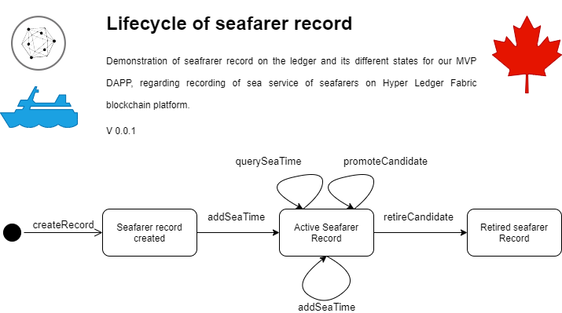
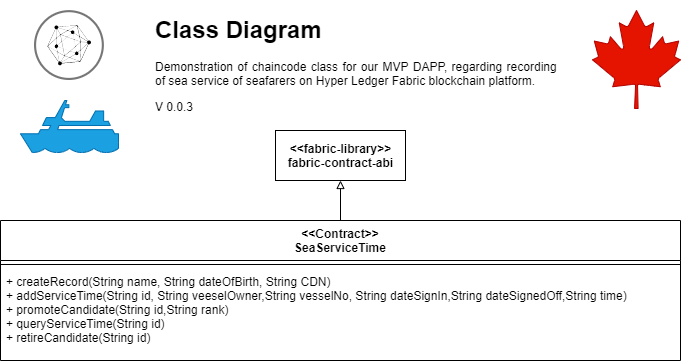
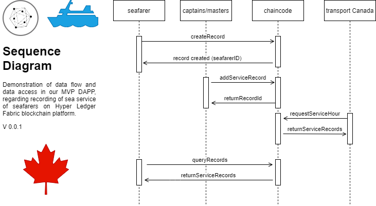

# sea-service-time

DAPP on Hyper Ledger Fabric for recording seafarers sea service time on a disterbuted ledger

## Modeling Ver:0.1.0

### Assets

#### Sea Service Record data structure as JSON

```json
{
  "name": "Abcd Efgh",
  "dateOfBirth": "YYYY/MM/DD",
  "cdn": "CDN",
  "id": "abcdEfghCDN",
  "seaTime": "DD",
  "status": "GRAD || ACTIVE || RETIRED",
  "rank": "Master Mariner || Chief Mate || Watchkeeping Mate || Cadet",
  "dateReg": "YYYY/MM/DD",
  "serviceTimes": []
}
```

## Lifescyle and state Diagram

 <div align="center" >
      
  </div>

### Transactions

Checked functions will change the state of blockchain and will cause a transaction on blockchain

- [x] create record
- [x] add sea time
- [x] promote candidate
- [ ] query sea time
- [x] retire candidate

### Contract

=== SeaServiceTime ===

| Function         | Input                                                           | output                  | Description              |
| ---------------- | --------------------------------------------------------------- | ----------------------- | ------------------------ |
| createRecord     | \_name, \_dateOfBirth, \_cdn                                    | obj (serviceTimeRecord) | Create record            |
| addServiceTime   | \_id,\_vesselOwner,\_vesselNo,\_dateSignIn,\_dateSignOff,\_time | obj (serviceTimeRecord) | add service time         |
| promoteCandidate | \_id, \_newRank                                                 | obj (serviceTimeRecord  | promoting candidate      |
| queryServiceTime | \_id,                                                           | obj (serviceTimeRecord  | read service record      |
| retireCandidate  | \_id,                                                           | obj (serviceTimeRecord  | change status to retired |

## Class Diagram

 <div align="center" >
      
  </div>
  
=== exposed REST API endpoints details:

| HTTP Method | path                              | input                                            | output        |
| ----------- | --------------------------------- | ------------------------------------------------ | ------------- |
| + POST      | /api/contract/createRecord        | name,dateOfBirth,cdn                             | record object |
| + PUT       | api/contract/add-service-time/:id | vesselOwner-vesselNo-dateSignIn,dateSignOff,time | record object |
| + PUT       | /api/contract/promote/:id         | rank                                             | record object |
| + GET       | api/contract/query-service/:id    | N/A                                              | record object |
| + PUT       | /retire/:id                       | N/A                                              | record object |

## Sequence Diagram

 <div align="center" >
      
  </div>
